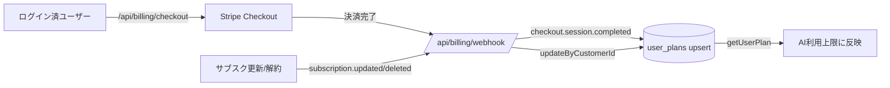

# Phase 2: Stripe課金フロー 実装計画と手順

目的: 無料→Pro→Premium のアップグレードを Stripe で実装し、**収益化できる状態**にする。
あわせて AI機能をログイン必須化し、プラン上限の逆転を修正する。

## 価格

| プラン | 月額(税込目安) | AI月間 | AI日次 | Watchlist |
|--------|--------------|--------|--------|-----------|
| Free | ¥0 | 30 | 5 | 5 |
| Pro | ¥980 | 1,000 | 50 | 50 |
| Premium | ¥2,980 | 5,000 | 300 | 200 |

（[plans.ts](../src/lib/plans.ts) で定義。Free < Pro < Premium の順に必ず増えるよう修正済み）

---

## コード側（このPRで実装済み）

| ファイル | 内容 |
|---------|------|
| [plans.ts](../src/lib/plans.ts) | 上限の逆転修正、`monthlyPriceJpy`、`priceIdForPlan`/`planKeyFromPriceId` |
| [stripe.ts](../src/lib/stripe.ts) | Stripeクライアント・`appBaseUrl` |
| [user-plan.ts](../src/lib/user-plan.ts) | `upsertUserPlanByUserId` / `updateUserPlanByCustomerId` / `getUserPlanRow` |
| [api/billing/checkout](../src/app/api/billing/checkout/route.ts) | Checkoutセッション作成（要ログイン） |
| [api/billing/portal](../src/app/api/billing/portal/route.ts) | 顧客ポータル（解約・カード変更） |
| [api/billing/webhook](../src/app/api/billing/webhook/route.ts) | 署名検証＋`user_plans`更新 |
| [PlanUpgradePanel](../src/components/PlanUpgradePanel.tsx) | settingsのアップグレード/管理UI |
| [ai-usage.ts](../src/lib/ai-usage.ts) | `aiLoginRequired`（本番でAI機能をログイン必須化） |
| [spot-simulator](../src/app/api/spot-simulator/ai-comment/route.ts) | 未ログイン時401 |

### Webhookフロー


---

## あなたの手動オペ

### 1. Stripe商品作成
1. https://dashboard.stripe.com → Products
2. 「Pro」作成: 定期・月額・¥980 → **Price ID** を控える
3. 「Premium」作成: 定期・月額・¥2,980 → **Price ID** を控える

### 2. APIキー
- Developers > API keys → `STRIPE_SECRET_KEY`（テストは `sk_test_`）

### 3. Webhook登録
1. Developers > Webhooks > Add endpoint
2. URL: `https://<your-domain>/api/billing/webhook`
3. イベント: `checkout.session.completed`, `customer.subscription.updated`, `customer.subscription.deleted`
4. 署名シークレット `whsec_...` → `STRIPE_WEBHOOK_SECRET`

### 4. Vercel環境変数（[.env.example](../.env.example) 参照）
```
STRIPE_SECRET_KEY=...
STRIPE_WEBHOOK_SECRET=...
STRIPE_PRICE_PRO=price_...
STRIPE_PRICE_PREMIUM=price_...
NEXT_PUBLIC_APP_URL=https://<your-domain>
```
設定後に再デプロイ。

---

## 検証手順

### ステップ1: テストモードで動作確認
- Stripeをテストモードにし、テスト用 `sk_test_` / Price ID / `whsec_` を設定
- `/settings` でログイン → 「Proにアップグレード」
- Stripeテストカード `4242 4242 4242 4242`（任意の将来日付・任意CVC）で決済
- 成功後 `/settings?billing=success` に戻る

### ステップ2: プラン反映確認
- Supabase `user_plans` に `plan=pro`, `stripe_customer_id`, `subscription_status=active` が入る
- `/settings` のCurrentが Pro になる

### ステップ3: Webhook確認
- Stripe Dashboard > Webhooks でイベントが 200 で受信されている
- ローカルは `stripe listen --forward-to localhost:3000/api/billing/webhook` で検証可能

### ステップ4: 解約確認
- 「プラン管理」→ Stripeポータルで解約 → `subscription.deleted` で `plan=free` に戻る

### 完了チェックリスト
- [ ] Stripe商品2つ作成・Price ID取得
- [ ] Vercelに5つの環境変数を設定＋再デプロイ
- [ ] テスト決済でPro/Premiumにアップグレードできる
- [ ] `user_plans` が更新される
- [ ] 解約でFreeに戻る
- [ ] 未ログインでAI診断が401になる（本番）

---

## セキュリティ・運用メモ
- `STRIPE_SECRET_KEY` / `STRIPE_WEBHOOK_SECRET` はサーバー専用。公開厳禁（`NEXT_PUBLIC_` を付けない）。
- Webhookは署名検証必須（実装済み）。検証失敗は400で拒否。
- `user_plans` の書き込みはサービスロール経由（RLSをバイパス）。クライアントからは書き込ませない。
- 本番反映は **テストモードで全フロー確認後** に本番キーへ切り替えること。

## Phase 2 では扱わない（次フェーズ候補）
- 同意記録のDB化・利用規約/特商法ページ（課金事業者として要整備）
- 請求書・領収書のカスタム送付
- 年額プラン・無料トライアル
- 銘柄の汎用化（RGTI固定の解消）
